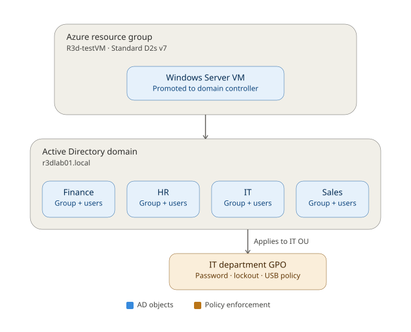

# Azure Active Directory Lab

A hands-on Active Directory environment built from scratch in a Windows Server VM hosted on Azure — domain controller, department-based OUs, security groups, bulk user provisioning, and GPO-enforced security controls.

Full walkthrough: [Loom video](https://loom.com/share/a5a64df4242d4ab890a3e684d92d975a)

## Why this lab

Most mid-size and enterprise orgs still run identity through Active Directory — onboarding, department access, password policy, and endpoint lockdown all trace back to a domain controller somewhere. This lab builds one end to end, then documents the decisions (and the mistakes) along the way.

## Architecture



An Azure resource group hosts a Windows Server VM promoted to a domain controller for `r3dlab01.local`. The domain is organized into four department OUs (Finance, HR, IT, Sales), each with a matching security group. A GPO linked to the IT OU enforces password, lockout, and USB policy.

## Environment

| Component | Detail |
|---|---|
| VM | `R3d-testVM`, Standard D2s v7 |
| Domain | `r3dlab01.local` (new forest) |
| OUs | Finance, HR, IT, Sales, Computers, Test |
| Users | 20+, provisioned via bulk script into department OUs and groups |
| GPO | `R3dlab01-IT-GPO1`, linked to the IT OU |

Each department OU holds a matching security group and its users: `R3dlab01-IT_Admins`, `R3dlab01-Finance_Users`, `R3dlab01-HR_Users`, `R3dlab01-Sales_Users`. Bulk provisioning reads `data/NewUsers.csv` via `scripts/Add-BulkUsers.ps1` — 20 users split 5 each across IT, Finance, HR, and Sales.

## GPO: R3dlab01-IT-GPO1 (linked to the IT OU)

**Password policy** — Computer Configuration → Policies → Windows Settings → Security Settings → Account Policies → Password Policy:
- Minimum password length: 12 characters
- Password must meet complexity requirements: Enabled

**Inactivity lock** — machine locks after 15 minutes (900 seconds) of inactivity.

**Removable storage** — Computer Configuration → Policies → Administrative Templates → System → Removable Storage Access:
- All Removable Storage classes: Deny all access — Enabled

### The gotcha: OU-linked GPOs don't set domain password policy

Windows enforces one password and account lockout policy per domain for domain (Kerberos) accounts, sourced from the Default Domain Policy — not from whatever GPO is linked to a user's OU. A password policy linked to an OU only affects local accounts on computer objects inside that OU.

To apply different password requirements to different groups of users within the same domain, use **Fine-Grained Password Policies (PSOs)** instead of an OU-linked GPO.

## Admin tasks (scripts/Manage-AccountTasks.ps1)

- Reset a user's password and require change at next logon
- Disable a departed employee's account (e.g. `david.darks`)
- Unlock a locked-out account (e.g. `carol.charles`)
- Audit disabled accounts: `Search-ADAccount -AccountDisabled | Select-Object Name, SamAccountName`

## Repo structure

```
azure-ad-lab/
├── data/
│   └── NewUsers.csv               # bulk user source data (synthetic lab data)
├── docs/
│   └── architecture-diagram.svg   # environment architecture
├── scripts/
│   ├── New-OUStructure.ps1        # creates department OUs (placeholder)
│   ├── New-SecurityGroups.ps1     # creates matching security groups (placeholder)
│   ├── Add-BulkUsers.ps1          # bulk-provisions users into OUs/groups
│   └── Manage-AccountTasks.ps1    # password reset, disable, unlock
└── README.md
```

> `New-OUStructure.ps1` and `New-SecurityGroups.ps1` are currently placeholders — swap in your real versions when you have them handy.

## Reproducing the lab

1. Deploy a Windows Server VM in Azure and connect via RDP.
2. Install the AD DS role and Group Policy Management Console (Server Manager → Add Roles and Features).
3. Promote the server to a domain controller, creating a new forest.
4. Run `scripts/New-OUStructure.ps1` to create the department OUs.
5. Run `scripts/New-SecurityGroups.ps1` to create the matching security groups.
6. Copy `data/NewUsers.csv` to `C:\Temp\NewUsers.csv` on the VM, then run `scripts/Add-BulkUsers.ps1` to provision each user into their OU and group.
7. Build the GPO in Group Policy Management, linked to the target OU, and configure password policy, inactivity lock, and removable storage restrictions (see the GPO section above for the exact settings used).
8. Use `scripts/Manage-AccountTasks.ps1` for day-to-day admin tasks — password resets, disabling departed accounts, unlocking locked-out accounts.

**Before you push:** `Add-BulkUsers.ps1` sets a shared temporary password in plain text (forced to change at first logon). That's fine for a disposable lab domain, but rotate it — or swap in `Read-Host -AsSecureString` — before treating this script as a template for anything real.

## Biggest lesson learned

Domain password policy lives at the domain level (or in a Fine-Grained Password Policy), not in a GPO linked to an OU — see [the gotcha above](#the-gotcha-ou-linked-gpos-dont-set-domain-password-policy) for the full explanation.

## What's next

- Move password enforcement to a Fine-Grained Password Policy (PSO) instead of an OU-linked GPO
- Rebuild the environment in Terraform/Bicep + DSC for full reproducibility
- Replace public-IP RDP with Azure Bastion or JIT access
- Add Azure Monitor / Log Analytics for AD event visibility
